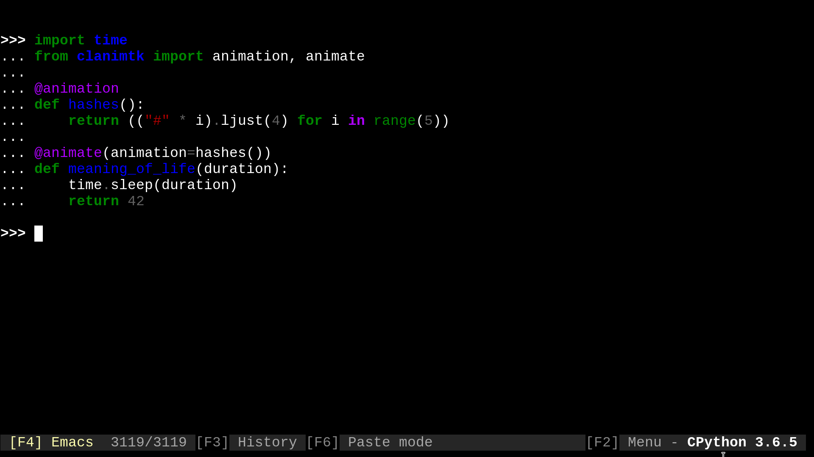

# clanimtk - Command Line Animation Toolkit

[](https://travis-ci.org/slarse/clanimtk)
[](https://codecov.io/gh/slarse/clanimtk)
[](https://clanimtk.readthedocs.io/en/latest/)
[](https://badge.fury.io/py/clanimtk)
[](https://badge.fury.io/py/clanimtk)


> The `scrolling_text` animation can be found in the
> [`clanim`](https://github.com/slarse/clanim) package, which contains some
> examples of how one can use `clanimtk`.

### Overview

`clanimtk` (Command Line Animation Toolkit) is a toolkit for quickly creating
custom command line animations. It is most suitable for long-running tasks that
are primarily I/O bound, as the animations themselves will require some CPU
time. It is strongly recommended to have a look at the brief introduction in
the [Docs](https://clanimtk.readthedocs.io/en/latest/) before using `clanimtk`.
If you just want to dive right in without reading any documentation, here is a
minimal example.

```python
import time
from clanimtk import animation, animate

@animation
def hashes():
    return (("#" * i).ljust(4) for i in range(5))


@animate(animation=hashes()) # note that the Animation is called to produce an AnimationGenerator
def sleep(duration):
    time.sleep(duration)
    return 42
```

which results in the folowing animation:



The whole thing is explained in detail in the
[Docs](https://clanimtk.readthedocs.io/en/latest/).

### Requirements

`clanimtk` is pure Python, so all you need is Python 3.6 or higher and a
terminal emulator that supports
[ANSI escape sequences](https://en.wikipedia.org/wiki/ANSI_escape_code)
(which most terminal emulators do!).

### Install

#### Option 1: Install release version from PyPi with `pip`

The latest release of `clanimtk` is on PyPi, and can thus be installed as with
`pip install clanimtk` (with your own preferred options, of course).

#### Option 2: Clone the repo and the install with `pip`

If you want the dev version, you will need to clone the repo, as only release versions are uploaded
to PyPi. Unless you are planning to work on this yourself, I suggest going with the release version.

1. Clone the repo with `git`:
    - `git clone https://github.com/slarse/clanimtk`
2. `cd` into the project root directory and install with `pip`.
    - `pip install --user .`, this will create a local install for the current user.
    - Or just `pip install .` if you use `virtualenv`.
    - For development, use `pip install -e .` in a `virtualenv`.
   
### License

This software is licensed under the MIT License. See the [LICENSE](LICENSE)
file for specifics.

### Contributing

I gladly accept contributions if they are in line with my vision for the
toolkit (which is hard to put into words). If you have an idea that you want
to discuss with me, don't hesitate to contact me! Most welcome additions are
tests, documentation as well as overall improvements to the core animation
loop (which is currently threaded and not particularly efficient).
