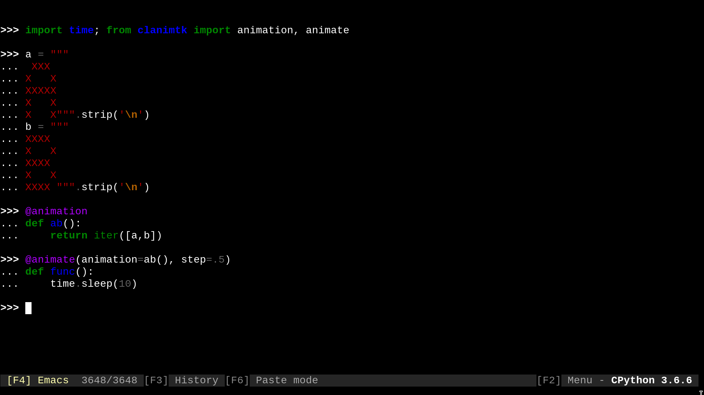

clanimtk
*******************************************************

`Docs`_

.. image:: https://travis-ci.org/slarse/clanimtk.svg?branch=master
    :target: https://travis-ci.org/slarse/clanimtk
    :alt: Build Status
.. image:: https://codecov.io/gh/slarse/clanimtk/branch/master/graph/badge.svg
    :target: https://codecov.io/gh/slarse/clanimtk
    :alt: Code Coverage
.. image:: https://readthedocs.org/projects/clanimtk/badge/?version=latest
    :target: http://clanimtk.readthedocs.io/en/latest/?badge=latest
    :alt: Documentation Status
.. image:: https://badge.fury.io/py/clanimtk.svg
    :target: https://badge.fury.io/py/clanimtk
    :alt: PyPi Version
.. image:: https://img.shields.io/badge/python-3.6-blue.svg
    :target: https://badge.fury.io/py/pdfebc
    :alt: Supported Python Versions

.. contents::

.. image:: images/hello_world.gif
    :alt: Scrolling text animation

    The ``scrolling_text`` animation can be found in the ``clanim`` package,
    which contains some examples of how one can use ``clanimtk``.

Overview
========
``clanimtk`` (Command Line Animation Toolkit) is a toolkit for quickly creating
custom command line animations.

Core concepts
=============
``clanimtk`` works with a few, simple core concepts that revolve around certain
object types. It is beneficial to keep these in the back of the head when
using the toolkit.

* **Frame:** A string with fixed linelength. I.e., Either there is only
  one line in the string, or each newline character is preceeded by the exact
  same amount of characters.
* **FrameGenerator:** A ``FrameGenerator`` is any generator that has no
  sendtype nor returntype, and yields any number of ``Frame`` strings that
  have identical dimensions. That is to say, each ``Frame`` yielded by
  the generator must have the same amount of lines, and same linelength,
  as all of the others.
* **FrameFunction:** Any function that returns a ``FrameGenerator``.
* **AnimationGenerator:** A generator that yields an endless amount of
  ``Frame`` strings, but each ``Frame`` is terminated by backspace/up
  character such that printing the ``Frame`` results in the cursor ending
  up at its start position.
* **Animation:** Any function that returns an ``AnimationGenerator``.

All of these types, along with some other types used in the package, are
type-defined in the `types module`_. Do note that several of the types
are simply aliases of each other, or other existing types.

Knowing about these concepts, we can turn to the main functionality of
``clanimtk``, which is provided in the form of two decorators.

* **@animation:** Turns a ``FrameFunction`` into an ``Animation``.
* **@animate:** Given an ``AnimationGenerator``, ``@animate`` will print
  frames to stdout as long as the decorated function is running.

Using ``clanimtk``, the only thing you need to write yourself to create a
custom animation is a ``FrameFunction``. Decorating a ``FrameFunction``
with the ``@animation`` decorator will transform the function into an
``Animation``. Below is a minimal example with the default animation
of ``clanimtk``.

.. code-block:: python
    
    from clanimtk import animation

    @animation
    def hashes():
        return (("#" * i).ljust(4) for i in range(5))

The function returns a generator which yields the strings ``"    "``, ``"#
"``, ``"## "``, ``"### "`` and ``"####"``. Each has one line and is 4
characters wide, so by definition the generator is a ``FrameGenerator``, making
the function a ``FrameFunction``. Applying the ``@animation`` decorator
transforms it into an ``Animation``. The ``AnimationGenerator`` it returns
can be used with the ``@animate`` decorator:

.. code-block:: python

    from clanimtk import animate
    import time

    @animate(animation=hashes()) # note that the Animation is called to produce an AnimationGenerator
    def sleep(duration):
        time.sleep(duration)
        return 42
        
You can see the not-too-impressive results in the gif below.

.. image:: images/example_animation.gif
    :alt: An example animation

Creating a multiline animation is similarly simple, you simply create ``Frame``
strings that each have the same number of lines.

.. code-block:: python
    
    import time
    from clanimtk import animation, animate

    # note that there is invisible whitespace to the right
    # of some characters. For example, the first line in the
    # A actually looks like `_XXX_`, where `_` is a space.
    a = """
     XXX 
    X   X
    XXXXX
    X   X
    X   X""".strip('\n')

    b = """
    XXXX 
    X   X
    XXXX 
    X   X
    XXXX """.strip('\n')
    
    @animation
    def ab():
        return iter([a, b])

    @animate(animation=ab(), step=.5) # step is approx seconds between frames
    def func():
        time.sleep(10)

This ends up looking like this:

For more examples, have a look at the ``clanim`` package!

Requirements
============
* For production use, only `daiquiri` is required (for logging).
* For development, see `requirements.txt`_.

Install
=======
Option 1: Install from PyPi with ``pip``
----------------------------------------
The latest release of ``clanimtk`` is on PyPi, and can thus be installed as usual with ``pip``.
I strongly discourage system-wide ``pip`` installs (i.e. ``sudo pip install <package>``), as this
may land you with incompatible packages in a very short amount of time. A per-user install
can be done like this:

1. Execute ``pip install --user clanimtk`` to install the package.
2. Further steps to be added ...

Option 2: Clone the repo and the install with ``pip``
-----------------------------------------------------
If you want the dev version, you will need to clone the repo, as only release versions are uploaded
to PyPi. Unless you are planning to work on this yourself, I suggest going with the release version.

1. Clone the repo with ``git``:
    - ``git clone https://github.com/slarse/clanimtk``
2. ``cd`` into the project root directory and install with ``pip``.
    - ``pip install --user .``, this will create a local install for the current user.
    - Or just ``pip install .`` if you use ``virtualenv``.
    - For development, use ``pip install -e .`` in a ``virtualenv``.
3. Further steps to be added ...
   
License
=======
This software is licensed under the MIT License. See the `license file`_ file for specifics.

Contributing
============
To be added ...

.. _license file: LICENSE
.. _sample configuration: config.cnf
.. _types module: clanimtk/types.py
.. _requirements.txt: requirements.txt
.. _Docs: https://clanimtk.readthedocs.io/en/latest/
